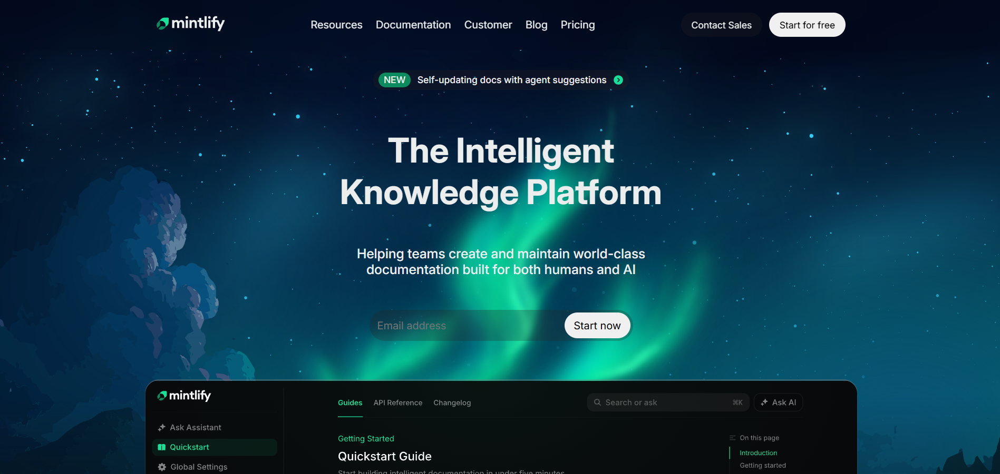

# Mintlify Documentation Style Clone (HTML + CSS)

A desktop-first documentation-style website inspired by the Mintlify website.

This project focuses on content structure, layout accuracy, typography, spacing, and readability using only HTML and CSS.

---

## 🔗 Live Preview

**Live Website:**  
https://mintlify-frontend.netlify.app/  

**GitHub Repository:**  
https://github.com/rohitchornele/mintlify-frontend-clone
---

## 📌 Project Overview

The objective of this assignment was to recreate a documentation-style landing page structurally similar to Mintlify while following strict constraints:

- No JavaScript  
- No TailwindCSS  
- No animations  
- Desktop-only layout  
- Clean and semantic HTML  

The focus was on layout precision, sidebar structure, content hierarchy, typography, and overall readability.

---

## 🧱 Sections Implemented

1. Top Navigation Bar  
   - Logo  
   - Navigation links  
   - Primary CTA button  

2. Hero Section  
   - Main headline  
   - Short supporting description  
   - Email input field  
   - CTA button  
   - Large background illustration  

3. Documentation Preview Section  
   - Static sidebar-style navigation  
   - Main documentation content cards  
   - Structured content layout  

4. Trusted By Section  
   - Horizontal row of company logos  

5. Feature Highlights  
   - Two-column layout (text + visual)  
   - Clear content hierarchy  

6. Intelligent Assistant / UI Preview  
   - Large UI mockup  
   - Supporting descriptive content  

7. Enterprise Features Section  
   - Section title  
   - Short introduction  
   - Feature blocks (security, compliance, scalability, etc.)  

8. Case Studies / Customer Stories  
   - Card-based layout  
   - Image + short descriptive text  

9. Final Call-To-Action Section  
   - Strong heading  
   - CTA buttons  

10. Footer  
    - Multi-column link layout  
    - Company information  
    - Legal links  

---

## 🎨 Design System

### Fonts
- Primary: Inter 
- Font weights used: 400, 500, 600, 700  

### Color Palette
- main-bg-color: #08090b
- second-bg-color: #151716
- primary-text-color: #eceeee
- secondary-text-color: #7d7f7e
- emrald-color: #0c8b5e 
- emrald-light: #18e299 
- btn-background: #29212144; 

### Layout Approach
- Desktop-first fixed-width container  
- Sidebar + content layout structure  
- CSS Flexbox and Grid for alignment  
- Consistent vertical rhythm and spacing  
- Clear typographic hierarchy for documentation feel  

---

## 🛠 Tech Stack

- HTML5 (Semantic structure)  
- CSS3 (Flexbox + Grid)  
- No frameworks  
- No JavaScript  

---

## 📂 Project Structure

```
mintlify-docs-clone/
│
├── index.html
├── style.css
├── assets
└── README.md
```

---

## 🖼 Screenshots

### Hero Section :
 

---

## ✅ Evaluation Criteria Addressed

- Structural accuracy compared to the reference site  
- Clear documentation-style layout  
- Proper sidebar and main content alignment  
- Font, spacing, and color consistency  
- Clean and semantic HTML usage  
- Overall fidelity to the original design  

---

## 📌 Notes

- This implementation is desktop-only as per assignment requirements.  
- No animations or interactive behavior were added.  
- Images and brand assets were referenced where possible to maintain visual accuracy.  
